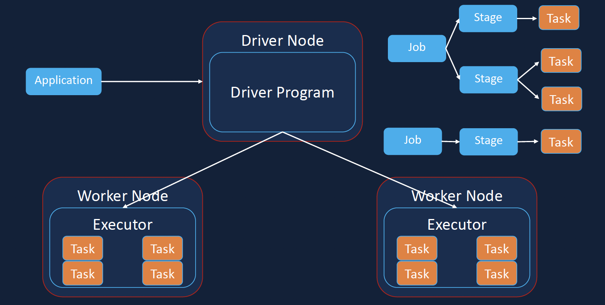

# formula1_DE_project
This is a ETL project for formula1 database. The programming language icnludes python, sql.

## Database Description

### spark architecture 

The driver assigns the tasks to a slot in the executor and the executor performs these operations. Then, the executor performs the computations.

The raw data should be processed as dataframe by using dataframe API, we can write it in the data sink as ORC, parquet format for big data scale.

### Data ingestion

