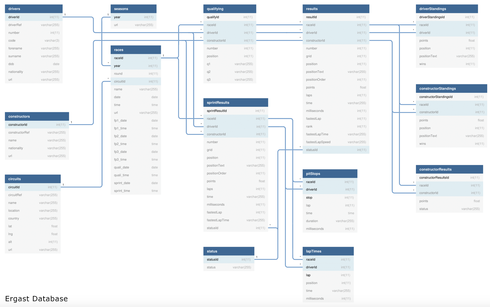

# formula1_DE_project
This is a ETL project for formula1 database. The programming language icnludes python, sql.
## The structure of project repository

```
FORMULA1_DE_PROJECT
├── README.md 
├── Formula1 
    ├── analysis 
    ├── dataset
    ├── includes
    ├── ingestion
    ├── raw
    ├── set-up
    ├── trans
    └── utlis
└── fig 

```


## Database Description

Below is the ER diagram of this Ergast dataset.



We will only use 8 tables: 

| File Name     | File type        | Incremental?  | Primary key             |
| ------------- | -------------    | ------------- |------------------------ |
| races         | csv file         |   No          |raceId                   |
| constructors  | json file        |   No          |constructorId            |
| drivers       | json file        |   No          |driverId                 |
| circuits      | csv file         |   No          |circuitId                |
| lap times     | folder csv files |   Yes         |raceId, driverId and lap |
| pit stops     | json file        |   Yes         |raceId, driverId and stop|
| qualifying    | folder json files|   Yes         |qualifyId                |
| results       | csv file         |   Yes         |resultId                 |
### 1. Non-incremental data
```circuits:``` --> csv file, primary key: circuitId

```races``` --> csv file, primary key: raceId

```constructors``` --> json file, primary key: constructorId

```drivers``` --> json file, primary key: driverId

### 2. Incremental data
```lap times``` --> folder csv files, primary key: raceId, driverId and lap

```pit stops``` --> json file, primary key: raceId, driverId and stop

```qualifying```--> folder json files, primary key: qualifyId

``` results``` --> csv file, primary key: resultId


### spark architecture 


The driver assigns the tasks to a slot in the executor and the executor performs these operations. Then, the executor performs the computations.


The raw data should be processed as dataframe by using dataframe API, we can write it in the data sink as ORC, parquet format for big data scale.


### The general workflow of this formula1 project

Below is the figure of this project workflow:


The workflow describes the ETL pipeline to ingest Formula1 racing data, transform the data and load it into the data warehouse for future reporting and analysis. 


The data from Ergast API is stored in the ADLS GEN2. The transformation is performed on azuer databrick.

### Azure configuration for the access of ADLS
During completing this project, I only obtain student azure account, which cannot use the service pricipals method to access ADLS. No mount functions.

However, I set the ```cluster scoped credentials``` for finishing this project. 

Azure Key Vault is utilized to secure secrets, which can provide convenient management for keys, secrets and certificates.


Create the hive database and set its location under our ADLS container. There are 3 databases: raw, processed and presentaion. Once we set its location under ADLS, the data in hive database will be sychronized with ADLS. 

### Data ingestion

Under this foloder ```Formula1/Ingestion/ ```, all the ingestion notebook in databricks can be found here.

The incremental dataset can be found under this folder ```Formula1/dataset```. There are 3 foloders: 2021-03-21, 2021-03-28 and 2021-04-18. 

Since ADLS(data lake) does not support ACID transactions, and obtains many pitfall. The delta lake has been chosen for this project.


### Data transformation

In order to use the data ingested from Eragast API, we created 3 notebooks to transform the data. 

Race_results, driver_standings, constructor_standings.

We can read the data from delta lake, which has been stored there. 

For race_results, we use 5 tables: races, drivers, constructors, circuits and results. By using JOIN operations, we can merge these tables and get the final race_results. Then, we can calculate who is the top10 drivers and constructors from race_results by implementing driver_standings and constructor_standings notebooks.

### Data analysis
#### Using databricks dashbooard for visualization

1. The top 10 drivers analysis --> You can find the notebook in ```Formula1/analysis/3.viz_dominant_driver.py```


2. The top 10 dominant teams analysis --> You can find the notebook in ```Formula1/analysis/4.viz_dominant_team.py```


#### Using Power BI to visualize the data

In Power BI, set the configuration to connect with databricks working space. This is a third-party service.


### Azure Data Fatory 

You can find the pipeline in this folder ```azure_data_factory/pipleline```. 

*1. Ingestion pipeline*

The logic of this pipeline is that we get the folder details from ADLS. Then, check if the date in this folder exists. If True, then running all 8 ingetion notebooks. If False, then stop.


Then, after ingestion, we will run the transform pipeline. Firstly, we transform selected 5 ingested files data, then get the race_results. After this, we can use this race results to calculate dominant drivers and teams. Only when the transforma_race_results pipeline is done, then we can move to next two pipelines.


Then, we can merge these 2 pipeline in one activity, so that we dont have to run it respectively.


The Data factory advantages:

* Scheduled to run every Sunday at 10 pm.
* Ability to monitor pipelines.
* Ability to rerun failed pipelines.
* Ability to set up alerts on failures


### Technologies/ Tools used

* Technologies/Tools Used:
* Pyspark
* Spark SQL
* Delta Lake
* Azure Databricks
* Azure Data Factory
* Azure Date Lake Storage Gen2
* Azure Key Fault
* Power BI
